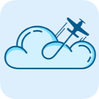
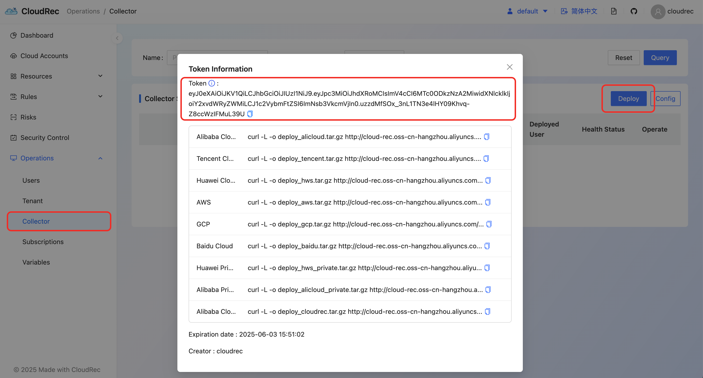
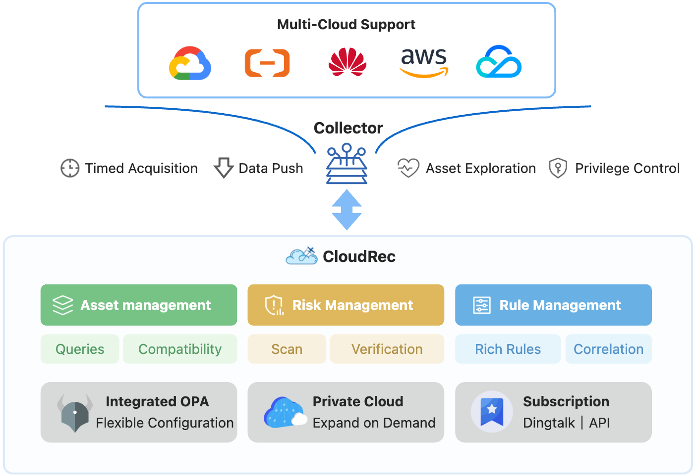

<div align="center">
  <h1> CloudRec</h1>
  <p>
    
    <a href="https://docs.cloudrec.cloud"></a>
    <a href="https://cloudrec.yuque.com/org-wiki-cloudrec-iew3sz/hocvhx"></a>
    <a href="https://discord.gg/WpWT9Q8BkD"></a>
    <a href="https://qr.dingtalk.com/action/joingroup?code=v1,k1,rsTf3mOAcQuKrY0//YlclWTUG4zcL9eQGsJIjjDj88A=&_dt_no_comment=1&origin=11"></a>
    <a href="https://demo.cloudrec.cloud"></a>
    </a>
  </p>
</div>

CloudRec is an open source multi-cloud security posture management (CSPM) platform designed to help organizations improve the security of their cloud environments. CloudRec provides an open and scalable cloud assets collection framework and an OPA-based rule management engine. Based on CloudRec, you can easily implement comprehensive asset collection, real-time security inspection, and risk event operation in an enterprise cloud environment.

---

# Features

+ [🔗Rich inspection rules ](https://docs.cloudrec.cloud/Introductions/Detectionrules/)in addition to the built-in high-risk rules, it provides a flexible rule configuration engine based on OPA and supports multiple asset association analysis.
+ [🔗Multi-Cloud support ](https://docs.cloudrec.cloud/Introductions/Multi-Cloudsupport/): Built-in support for Alibaba Cloud, AWS, GCP and other cloud service providers, and can expand proprietary cloud on demand; It also provides Collector collection framework, which can be expanded and support other cloud vendors on demand.
+ User-friendly page: intuitive UI interface, convenient for users to carry out asset management, rule editing, risk operation, support multi-tenant

## 🌟 Modules

| Function Modules        | Description                                                  |
| ----------------------- | ------------------------------------------------------------ |
| **Resource Discovery** | Covers mainstream public cloud platforms, automatically discovers 30+ cloud services and 200+ resource types, provides framework-level supports, and can be easily expanded on demand. |
| **Risk Detection**     | Based on enterprise-level real-world rules, covering multiple scenarios such as network protection, identity security, security protection, data protection, and log auditing. |
| **Policy Engine**      | Declarative policy management based on OPA, which can be dynamically adjust without hard coding, and no need to re-deploy |
| **Repair Closed Loop** | Integrated enterprise WeChat/DingTalk, alarm policy can be flexibly configured |


---

# 🚀 Quick Start
### Deploy Server
```
git clone https://github.com/antgroup/CloudRec.git

cd CloudRec

MYSQL_ROOT_PASSWORD=$(openssl rand -base64 16) docker-compose up -d
```
Access http://localhost:8080 after deployment.
### Deploy Collector
Login and get AccessToken for authentication of collector.

```
docker exec -it cloudrec-cloud-rec-1 bash

nohup ./collectors --accessToken "${AccessToken}" > logs/task.log 2>&1 < /dev/null &
```

# 🏗 Architecture



# 📚 Key Concepts

## 📡 Collector

```yaml
# Collector name, if not configured, hostname will be used
AgentName: "Alibaba CloudHuawei Cloud, AWS,Tencent Cloud,GCP,Baidu Cloud Collector"
# The server URL, http://localhost:8080 is used by default, and can be adjusted according to actual conditions
ServerUrl: "http://localhost:8080"

# eg：@every 30s、@every 5m、@every 1h
# @every 5m means obtaining an account every five minutes. If the current task is finished, skip this task.
Cron: "@every 5m"

# If RunOnlyOnce is set to false, the program will be executed once immediately, but the program will not exit. It will be run regularly according to the Cron cycle.
# If RunOnlyOnce is set to true, the program will be executed once immediately and then exit.
RunOnlyOnce: false

# Access token, which is used to authenticate the request. You can get it from the server
AccessToken: "change your access token"

#  Deployment site. If the deployment site is configured as 'S1', only cloudAccount of this site can be obtained. If the deployment site is not configured, all cloudAccount can be obtained.
#  eg:["S1"]
#  eg:["S1","I2","TE"]
Sites: [  ]

# Pay attention to the risk error information. If the error message contains text, the risk will be submitted to the server
AttentionErrorTexts: [ "NoPermission", "NotAuthorized", "NotApplicable",
                       "Forbidden.RAM", "Forbidden", "Throttling.User", "Throttling", "InvalidAccessKeyId.NotFound", "ServiceUnavailable", "Forbidden" ]
```


## 📜 Rego Policy Sample

```javascript
package ecs_security_groups_misconfig
import rego.v1

default risk := false
risk if {
  has_public_address
  count(security_groups_misconfig) != 0
}

public_ip_address := input.Instance.PublicIpAddress.IpAddress
has_public_address if {
  count(public_ip_address) > 0
}

security_groups_misconfig contains sg_rule if {
  sg_rule := input.SecurityGroups[_].Permissions[_]
  parts := split(sg_rule.SourceCidrIp, "/")
  size := to_number(parts[1])
  size <= 8
  sg_rule.Direction == "ingress"
  sg_rule.Policy == "Accept"
}
```

# 🤝 How to contribute

To check detailed guidelines for new contributions, please refer (https://docs.cloudrec.cloud/ContributionGuide/ContributionStep.html)

## Contributors Wall
<a href="https://github.com/antgroup/CloudRec/graphs/contributors">
  
</a>

# **<font style="color:rgb(38, 38, 38);">📬</font>** Community

[https://discord.gg/WpWT9Q8BkD](https://discord.gg/WpWT9Q8BkD)

# 📜 LICENSE

This project uses the Apache-2.0 LICENSE, the full text of which is available in the LICENSE document. Commercial use is subject to supplementary terms.

