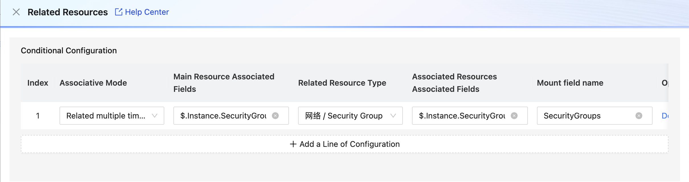
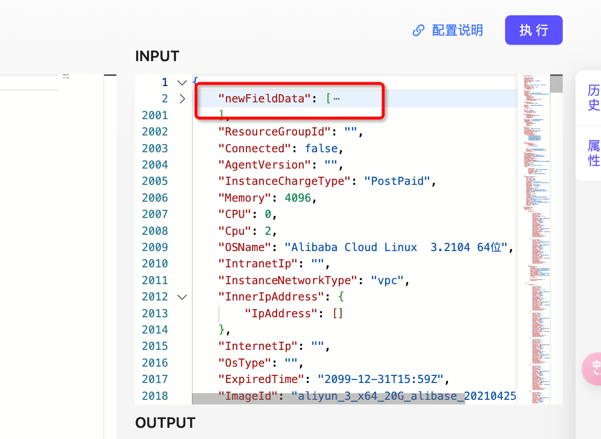
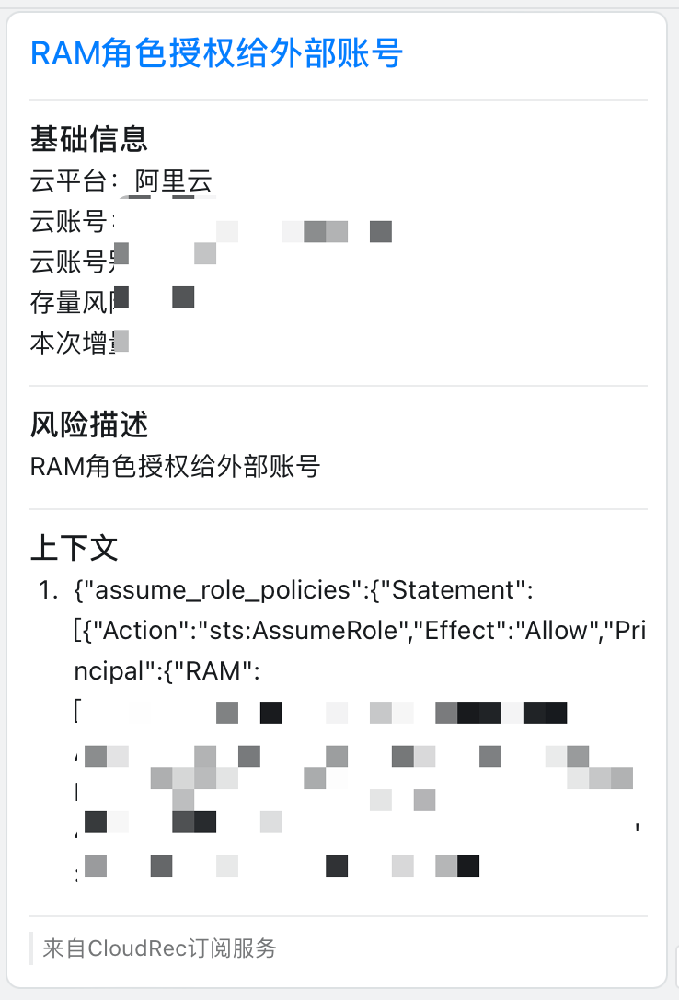
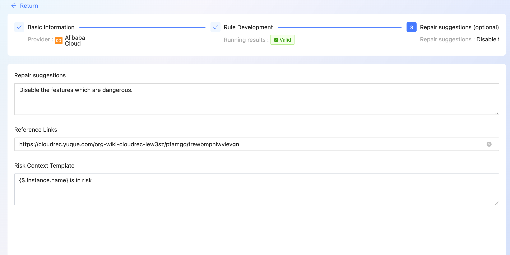

# Rules

The Rules module is used to create, query, and manage risk rules. 


# How to create rules 
1. click the [**Add Rule**] button on the right


2. select [Cloud Providers] 
3. select [Resource Type]
4. input [rule name] and [rule description]] 
5. select [Rule Group], [Rule Type] and [Risk Level]] 
6. click [Next] to enter the rule development page 


7. the [INPUT] section in the upper-right corner of the page body indicates that the system selects an instance configuration from existing resources for rule debugging. The resource type is the same as that selected in the previous step. 
8. [The Rego PlayGround] on The left side of The main body is The place where Rego rules are developed and edited. 
9. Click [Execute] in the upper right corner and run rego. The result is displayed in [OUTPUT] in the lower right corner] 


10. after completing the rule development and dryrun, click [Next] to enter the repair suggestion page 
11. complete [Repair Suggestion], [Reference Links], [risk Context Template ]
12. click [Submit] 


# **<font style="color:rgba(0, 0, 0, 0.88);">Related Resource</font>** function 
associate two different resources to address scenarios where data access across resource types is required for risk analysis.

We collect configurations such as security groups and ACL as a separate resource (Resorce). If you need to perform ECS Security Group configuration detection and LB ACL configuration detection, you need to associate the two resources on the platform. 

## Process 
for example, when analyzing the risk that an Alibaba Cloud ECS instance is open to the entire network, you need to associate [ECS instance] with [security group] resources. 

1. Select Alibaba Cloud as the cloud platform and Compute/ECS as the resource type] 


2. at this time, you need to associate the resource data of the security group, and click [Related Resources] to configure it. 



+ resource Type: Select the resource type to be associated. 
+ Main resource Key: the ECS resource is used for the associated field, for example: <font style="color:rgb(0, 0, 0);">$.SecurityGroupIds.SecurityGroupId[*] </font>
+ associated resource Key: the field used to associate security group resources, such: <font style="color:rgb(0, 0, 0);">$.SecurityGroup.SecurityGroupId </font>
+ mount field name: the data associated to will be mounted on the new field 
3. results after correlation 



## description 
### value method 
path Rule Description 

```json
{
    "store": {
        "book": [
            {
                "category": "reference",
                "author": "Nigel Rees",
                "title": "Sayings of the Century",
                "price": 8.95
            },
            {
                "category": "fiction",
                "author": "Evelyn Waugh",
                "title": "Sword of Honour",
                "price": 12.99
            },
            {
                "category": "fiction",
                "author": "Herman Melville",
                "title": "Moby Dick",
                "isbn": "0-553-21311-3",
                "price": 8.99
            },
            {
                "category": "fiction",
                "author": "J. R. R. Tolkien",
                "title": "The Lord of the Rings",
                "isbn": "0-395-19395-8",
                "price": 22.99
            }
        ],
        "bicycle": {
            "color": "red",
            "price": 19.95
        }
    },
    "expensive": 10
}
```

| <font style="color:rgb(31, 35, 40);">JsonPath </font> | <font style="color:rgb(31, 35, 40);">Result </font> | <font style="color:rgb(31, 35, 40);">Value </font> |
| --- | --- | --- |
| `$.store.bicycle.color ` | <font style="color:rgb(31, 35, 40);">The bicycle color</font> | <font style="color:rgb(31, 35, 40);">red </font> |
| `<font style="color:rgb(31, 35, 40);">$.store.book[*].author </font>` | <font style="color:rgb(31, 35, 40);">The authors of all books </font> | <font style="color:rgb(31, 35, 40);">["Nigel Rees","Evelyn Waugh","Herman Melville","J. R. R. Tolkien"] </font> |


reference documentation: [https://github.com/json-path/JsonPath ](https://github.com/json-path/JsonPath)

### association Method 
the main resource Key and the associated resource Key are evaluated by using the json path expression. When the two values are equal, they are associated. One-to-one and one-to-many associations are supported. 


+ One-to-one association example: 


sample data A: 

```json

{
  "field1":"i-xxxxxxxxxx",
  "field2":"xxx"
}
```

sample data B: 

```json

{
  "field3":"i-xxxxxxxxxx",
  "field4":"xxx"
}
```

configure $.field1 and $.field3, and mount the field name newField to generate the result. 

```json

{
  "field1":"i-xxxxxxxxxx",
  "field2":"xxx",
  "newField":{
     "field3":"i-xxxxxxxxxx",
      "field4":"xxx"
  }
}
```

+ One-to-many association example 

sample data A: 

```json

{
  "field1":["i-xxxxxxxxxx"],
  "field2":"xxx"
}
```

sample data B: 

```json

{
  "field3":"i-xxxxxxxxxx",
  "field4":"xxx"
}
```

configure $.field1 and $.field3, and mount the field name newField to generate the result. 

```json

{
  "field1":"i-xxxxxxxxxx",
  "field2":"xxx",
  "newField":[
    {
     "field3":"i-xxxxxxxxxx",
      "field4":"xxx"
    }
  ]
}
```


# Risk Context Template 
the risk context template is used when subscribing to alarms to facilitate subscribers to quickly understand risk details. How to use the configuration to subscribe to alarms Read [subscribe to Alerts ](https://cloudrec.yuque.com/org-wiki-cloudrec-iew3sz/hocvhx/rqvy5gapmz43g29p).

Example of results 



#### how to configure risk context templates 
1. **when not configured, the full output of the Rego rule is used as the context by default.**
2. Use the jsonPath output from the run of the Rego rule to take the value from. The configuration method is as follows: 

```json
{$.Instance.name} is in risk
```



# next Reading 


