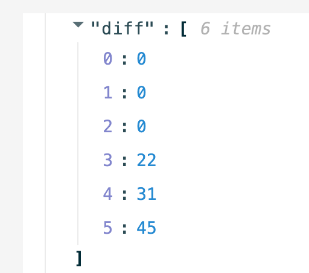

# Rules

# Purpose 
Since CloudRec rules are developed using the rego language of OPA, this article aims to help users quickly become familiar with rego syntax and cloudrec-specific rego constraints, and then develop rules to detect risks on the cloud.

# Basic Rego syntax
Everything you need：[Official documents of OPA](https://www.openpolicyagent.org/docs/latest/policy-language/)

# CloudRec requirements for Rego rules 
CloudRec requires a boolean rule named `risk`, which is used to determine whether a risk exists. Therefore, the recommended template is as follows: 

```plain
package {any_package_name}
import rego.v1

default risk := false
risk if {
  [any condition to tell a risk here]
}
```

## examples
### example 1 
rule name: Open access to the public network for a Kafka instance 

rule description: Kafka deployment type is public network/VPC instance, and public IP whitelist is 0.0.0.0/0 

```plain
package kafka_open_to_all_public
import rego.v1

default risk := false

risk if {
    is_internet_instance
    is_acl_misconfiguraion
}

is_internet_instance if {
    input.InstanceVO.DeployType == 4
}

internet_allowe_ip_list := input.AllowedList.InternetList[_].AllowedIpList

is_acl_misconfiguraion if {
    some acl in internet_allowe_ip_list
    acl == "0.0.0.0/0"
}
```

```json
{
    "AllowedList": {
        "DeployType": 4,
        "InternetList": [
            {
                "AllowedIpList": [
                    "0.0.0.0/0"
                ],
                "PortRange": "9093/9093",
                "AllowedIpGroup": {
                    "sasl-port": [
                        "ip.ip.ip.ip",
                        "0.0.0.0/0"
                    ]
                }
            }
        ],
        "VpcList": [
            {
                "AllowedIpList": [
                    "10.11.12.0/22"
                ],
                "PortRange": "9092/9092",
                "AllowedIpGroup": {
                    "alikafka_post-cn-kve3wexfg005": [
                        "10.11.12.0/22"
                    ]
                }
            }
        ]
    },
    "InstanceVO": {
        "DeployType": 4,
        "ReservedPublishCapacity": 0,
        "ResourceGroupId": "rg-aekxxxxxxxx6i",
        "SpecType": "normal",
        "IoMax": 20,
        "AllConfig": "{\"enable.vpc_sasl_ssl\":\"false\",\"kafka.log.retention.hours\":\"168\",\"kafka.offsets.retention.minutes\":\"20164\",\"enable.acl\":\"false\",\"kafka.ssl.bit\":\"4096\",\"enable.compact\":\"true\",\"kafka.message.max.bytes\":\"1048576\"}",
        "EndPoint": "10.11.12.13:9092,10.11.12.13:9092,10.11.12.14:9092",
        "UpgradeServiceDetailInfo": {
            "Current2OpenSourceVersion": "2.6.2"
        },
        "SaslDomainEndpoint": "",
        "Name": "alikafka_post-cn-name",
        "ViewInstanceStatusCode": 2,
        "ConfluentConfig": {
            "KsqlStorage": 0,
            "KafkaRestProxyCU": 0,
            "ZooKeeperReplica": 0,
            "KafkaReplica": 0,
            "ConnectReplica": 0,
            "ControlCenterStorage": 0,
            "SchemaRegistryCU": 0,
            "ConnectCU": 0,
            "KafkaCU": 0,
            "KsqlCU": 0,
            "ControlCenterReplica": 0,
            "KsqlReplica": 0,
            "SchemaRegistryReplica": 0,
            "KafkaRestProxyReplica": 0,
            "ZooKeeperCU": 0,
            "ZooKeeperStorage": 0,
            "ControlCenterCU": 0,
            "KafkaStorage": 0
        },
        "DiskType": 0,
        "SslDomainEndpoint": "alikafka-post-cn-name-1.alikafka.aliyuncs.com:9093,alikafka-post-cn-name-2.alikafka.aliyuncs.com:9093,alikafka-post-cn-name-3.alikafka.aliyuncs.com:9093",
        "ReservedSubscribeCapacity": 0,
        "ServiceStatus": 5,
        "ExpiredTime": 2040882749000,
        "MsgRetain": 168,
        "DiskSize": 600,
        "TopicNumLimit": 1002,
        "Tags": {
            "TagVO": [
                {
                    "Value": "axxxxxbs",
                    "Key": "app"
                },
                {
                    "Value": "",
                    "Key": "ekyt"
                },
                {
                    "Value": "EKYT",
                    "Key": "build_rego"
                }
            ]
        }
    }
}
```

### example 2 
rule NAME: Port 22 of the ECS Security group is open to the entire network 

rule description: Port 22 of the ECS Security group is open to the entire network 

```plain
package ecs_public_open_rule
import rego.v1

default risk := false

risk if {
    count(sg_with_22) > 0
    count(min_priority_with_drop) = 0
    has_public_address
}


instance_id := input.InstanceId
instance_name := input.InstanceName
public_ip_address := input.Instance.PublicIpAddress.IpAddress

## Rules
has_public_address if {
    count(public_ip_address) > 0
}

sg_with_22 contains p if {
    some p in input.SecurityGroups[_].Permissions
    parts := split(p.PortRange, "/")
    
    22 in numbers.range(to_number(parts[0]),to_number(parts[1]))
    p.SourceCidrIp == "0.0.0.0/0"
    p.Direction == "ingress"
}

extract_key_values(input_array, key) = values if {
    values := [v | i := input_array[_]; v := to_number(i[key])]
}

min_priority_with_drop contains p if {
    some p in sg_with_22
    to_number(p.Priority) == min(extract_key_values(sg_with_22,"Priority"))
    p.Policy == "Drop" 
}

```

```json
{
  "NetworkInterfaceSet": [
    {
      "Description": "",
      "PrivateIpAddress": "172.16.226.33",
      "DeleteOnRelease": true,
      "ResourceGroupId": "",
      "ServiceManaged": false,
      "Attachment": {
        "AttachedTime": "",
        "Identifier": "",
        "InstanceId": "",
        "NsId": 0,
        "AccessToken": "",
        "Device": "",
        "DeviceIndex": 0,
        "MemberNetworkInterfaceIds": {
          "MemberNetworkInterfaceId": null
        },
        "NetworkCardIndex": 0,
        "Nguid": "",
        "TrunkNetworkInterfaceId": "",
        "TargetDevice": ""
      },
      "NetworkInterfaceId": "eni-bp157ghnfufb9gxrskvu",
      "Ipv6Sets": {
        "Ipv6Set": []
      },
      "OwnerId": "1984445718834649",
      "AssociatedPublicIp": {
        "PublicIpAddress": "",
        "AllocationId": ""
      },
      "Tags": {
        "Tag": null
      },
      "Status": "InUse",
      "NetworkInterfaceTrafficMode": "Standard",
      "ZoneId": "cn-hangzhou-g",
      "InstanceId": "i-bp1g1k8avl28o0ywgmer",
      "VSwitchId": "vsw-bp1olewabvs4ha9q9rrn4",
      "NetworkInterfaceName": "",
      "MacAddress": "00:16:3e:09:6b:f6",
      "SecurityGroupIds": {
        "SecurityGroupId": [
          "sg-bp1c9njzlg43gr63ousv"
        ]
      },
      "ServiceID": 0,
      "SourceDestCheck": false,
      "Type": "Primary",
      "QueueNumber": 2,
      "QueuePairNumber": 0,
      "VpcId": "vpc-bp1r0492ng4r7btsoz8x4",
      "Ipv6PrefixSets": {
        "Ipv6PrefixSet": []
      },
      "CreationTime": "2019-04-15T09:43:45Z",
      "Ipv4PrefixSets": {
        "Ipv4PrefixSet": []
      },
      "PrivateIpSets": {
        "PrivateIpSet": [
          {
            "PrivateDnsName": "",
            "PrivateIpAddress": "172.16.226.33",
            "AssociatedPublicIp": {
              "PublicIpAddress": "",
              "AllocationId": ""
            },
            "Primary": true
          }
        ]
      }
    }
  ],
  "SecurityGroups": [
    {
      "Permissions": [
        {
          "Policy": "Accept",
          "SourceGroupId": "",
          "Description": "",
          "SourcePortRange": "",
          "Priority": "1",
          "CreateTime": "2019-05-23T06:12:06Z",
          "DestPrefixListName": "",
          "Ipv6SourceCidrIp": "",
          "NicType": "intranet",
          "DestGroupId": "",
                    "Direction": "ingress",
                    "SourceGroupName": "",
                    "DestGroupOwnerAccount": "",
                    "PortRange": "22/22",
                    "DestPrefixListId": "",
                    "SourceCidrIp": "119.110.100.86",
                    "SourcePrefixListName": "",
                    "IpProtocol": "TCP",
                    "DestCidrIp": "",
                    "DestGroupName": "",
                    "SecurityGroupRuleId": "sgr-somesecuritygroupruleid",
                    "Ipv6DestCidrIp": "",
                    "SourceGroupOwnerAccount": "",
                    "SourcePrefixListId": ""
                },
                {
                    "Policy": "Accept",
                    "SourceGroupId": "sg-somesecuritygroupid",
                    "Description": "云盾堡垒机自动添加规则",
                    "SourcePortRange": "-1/-1",
                    "Priority": "1",
                    "CreateTime": "2019-05-22T08:33:52Z",
                    "DestPrefixListName": "",
                    "Ipv6SourceCidrIp": "",
                    "NicType": "intranet",
                    "DestGroupId": "",
                    "Direction": "ingress",
                    "SourceGroupName": "",
                    "DestGroupOwnerAccount": "",
                    "PortRange": "-1/-1",
                    "DestPrefixListId": "",
                    "SourceCidrIp": "",
                    "SourcePrefixListName": "",
                    "IpProtocol": "ALL",
                    "DestCidrIp": "",
                    "DestGroupName": "",
                    "SecurityGroupRuleId": "sgr-somesecuritygroupruleid",
                    "Ipv6DestCidrIp": "",
                    "SourceGroupOwnerAccount": "1649796836582446",
                    "SourcePrefixListId": ""
                }
            ],
            "SecurityGroup": {
                "RuleCount": 66,
                "EcsCount": 0,
                "Description": "System created security group.",
                "ResourceGroupId": "",
                "SecurityGroupName": "sg-somesecuritygroupid",
                "ServiceManaged": false,
                "SecurityGroupId": "sg-somesecuritygroupid",
                "SecurityGroupType": "normal",
                "AvailableInstanceAmount": 0,
                "ServiceID": 0,
                "VpcId": "vpc-somevpcid",
                "GroupToGroupRuleCount": 1,
                "CreationTime": "2019-04-15T09:43:53Z",
                "Tags": {
                    "Tag": []
                }
            }
        }
    ],
    "Instance": {
        "ResourceGroupId": "",
        "AgentVersion": "",
        "Connected": false,
        "InstanceChargeType": "PrePaid",
        "Memory": 8192,
        "CPU": 0,
        "Cpu": 2,
        "OSName": "CentOS  7.6 64位",
        "IntranetIp": "",
        "InstanceNetworkType": "vpc",
        "InnerIpAddress": {
            "IpAddress": []
        },
        "InternetIp": "",
        "OsType": "",
        "ExpiredTime": "2025-04-24T16:00Z",
        "EipAddress": {
            "AllocationId": "",
            "Bandwidth": 0,
            "IpAddress": "",
            "IsSupportUnassociate": false,
            "InternetChargeType": ""
        },
        "ImageId": "centos_7.vhd",
        "ImageOptions": {
            "CurrentOSNVMeSupported": false,
            "LoginAsNonRoot": false
        },
        "HostName": "somehostname",
        "Tags": {
            "Tag": null
        },
        "VlanId": "",
        "Status": "Running",
        "HibernationOptions": {
            "Configured": false
        },
        "MetadataOptions": {
            "HttpPutResponseHopLimit": 0,
            "HttpTokens": "",
            "HttpEndpoint": ""
        },
        "InstanceId": "i-someinstanceid",
        "StoppedMode": "Not-applicable",
        "CpuOptions": {
            "TopologyType": "",
            "SupportedTopologyTypes": {
                "SupportedTopologyType": null
            },
            "ThreadsPerCore": 2,
            "Numa": "",
            "CoreCount": 1
        },
        "ActivationId": "",
        "Hostname": "",
        "StartTime": "2022-04-06T07:07Z",
        "PrivateDnsNameOptions": {
            "EnableInstanceIdDnsARecord": false,
            "HostnameType": "",
            "EnableIpDnsPtrRecord": false,
            "EnableIpDnsARecord": false,
            "EnableInstanceIdDnsAAAARecord": false
        },
        "DeletionProtection": false,
        "PrivatePoolOptionsMatchCriteria": "",
        "RegistrationTime": "",
        "SecurityGroupIds": {
            "SecurityGroupId": [
                "sg-somesecuritygroupid"
            ]
        },
        "VpcAttributes": {
            "PrivateIpAddress": {
                "IpAddress": [
                    "172.30.03.33"
                ]
            },
            "VpcId": "vpc-somevpcid",
            "VSwitchId": "vsw-somevswid",
            "NatIpAddress": ""
        },
        "InstanceOwnerId": 0,
        "InternetChargeType": "PayByTraffic",
        "PrivatePoolOptionsId": "",
        "DeploymentSetId": "",
        "InstanceName": "foundation1",
        "SpotInterruptionBehavior": "",
        "InternetMaxBandwidthOut": 20,
        "SerialNumber": "e499xxxx-xxxx-xxxx-xxxx-e499e499",
        "OSType": "linux",
        "CreationTime": "2019-04-15T09:43Z",
        "AutoReleaseTime": "",
        "MachineId": "",
        "Description": "",
        "LocalStorageCapacity": 0,
        "InstanceTypeFamily": "ecs.g5",
        "DedicatedInstanceAttribute": {
            "Tenancy": "",
            "Affinity": ""
        },
        "OsVersion": "",
        "SpotDuration": 0,
        "LocalStorageAmount": 0,
        "PublicIpAddress": {
            "IpAddress": [
                "119.110.100.86"
            ]
        },
        "GPUSpec": "",
        "NetworkType": "",
        "SocketId": "",
        "NetworkInterfaces": {
            "NetworkInterface": [
                {
                    "NetworkInterfaceTrafficMode": "",
                    "Description": "",
                    "SecurityGroupId": "",
                    "VSwitchId": "",
                    "NetworkInterfaceName": "",
                    "PrimaryIpAddress": "172.30.03.33",
                    "MacAddress": "00:16:3e:09:6b:f6",
                    "NetworkInterfaceId": "eni-someeniinstanceid",
                    "SecurityGroupIds": {
                        "SecurityGroupId": null
                    },
                    "Type": "Primary",
                    "Ipv6Sets": {
                        "Ipv6Set": null
                    },
                    "Ipv6PrefixSets": {
                        "Ipv6PrefixSet": null
                    },
                    "InstanceType": "",
                    "Ipv4PrefixSets": {
                        "Ipv4PrefixSet": null
                    },
                    "PrivateIpSets": {
                        "PrivateIpSet": [
                            {
                                "PrivateDnsName": "",
                                "PrivateIpAddress": "172.30.03.33",
                                "AssociatedPublicIp": {
                                    "PublicIpAddress": "",
                                    "AllocationId": ""
                                },
                                "Primary": true
                            }
                        ]
                    }
                }
            ]
        },
        "SpotPriceLimit": 0,
        "DeviceAvailable": true,
        "SaleCycle": "",
        "InstanceType": "ecs.g5.large",
        "OSNameEn": "CentOS  7.6 64 bit",
        "SpotStrategy": "NoSpot",
        "IsSpot": false,
        "KeyPairName": "",
        "IoOptimized": true,
        "ZoneId": "cn-hangzhou-g",
        "ClusterId": "",
        "HpcClusterId": "",
        "InvocationCount": 0,
        "ISP": "",
        "DeploymentSetGroupNo": 0,
        "EcsCapacityReservationAttr": {
            "CapacityReservationPreference": "",
            "CapacityReservationId": ""
        },
        "DedicatedHostAttribute": {
            "DedicatedHostId": "",
            "DedicatedHostName": "",
            "DedicatedHostClusterId": ""
        },
        "GPUAmount": 0,
        "OperationLocks": {
            "LockReason": []
        },
        "RdmaIpAddress": {
            "IpAddress": null
        },
        "InternetMaxBandwidthIn": 1000,
        "Recyclable": false,
        "LastInvokedTime": "",
        "RegionId": "cn-hangzhou",
        "CreditSpecification": ""
    },
    "Disks": [
        {
            "KMSKeyId": "",
            "ResourceGroupId": "",
            "Encrypted": false,
            "Size": 40,
            "DeleteAutoSnapshot": false,
            "IOPS": 3000,
            "MultiAttach": "Disabled",
            "Placement": {
                "ZoneIds": ""
            },
            "ExpiredTime": "2025-04-24T16:00Z",
            "ImageId": "centos_7.vhd",
            "StorageSetId": "",
            "Tags": {
                "Tag": []
            },
            "Status": "In_use",
            "AttachedTime": "2019-04-15T09:44:21Z",
            "IOPSRead": 0,
            "IOPSWrite": 0,
            "InstanceId": "i-someinstanceid",
            "ProductCode": "",
            "Device": "/dev/xvda",
            "DeleteWithInstance": true,
            "ProvisionedIops": 0,
            "BdfId": "",
            "ThroughputWrite": 0,
            "Portable": true,
            "MountInstanceNum": 0,
            "SerialNumber": "",
            "CreationTime": "2019-04-15T09:43:45Z",
            "DiskId": "d-somediskid",
            "DetachedTime": "",
            "Category": "cloud_ssd",
            "Description": "",
            "ThroughputRead": 0,
            "DiskChargeType": "PrePaid",
            "Throughput": 140,
            "StorageSetPartitionNumber": 0,
            "Attachments": {
                "Attachment": [
                    {
                        "AttachedTime": "2019-04-15T09:44:21Z",
                        "Identifier": "",
                        "InstanceId": "i-someinstanceid",
                        "NsId": 0,
                        "AccessToken": "",
                        "Device": "/dev/xvda",
                        "DeviceIndex": 0,
                        "MemberNetworkInterfaceIds": {
                            "MemberNetworkInterfaceId": null
                        },
                        "NetworkCardIndex": 0,
                        "Nguid": "",
                        "TrunkNetworkInterfaceId": "",
                        "TargetDevice": ""
                    }
                ]
            },
            "BurstingEnabled": false,
            "StorageClusterId": "",
            "ZoneId": "cn-hangzhou-g",
            "SourceSnapshotId": "",
            "PerformanceLevel": "",
            "EnableAutomatedSnapshotPolicy": false,
            "EnableAutoSnapshot": true,
            "AutoSnapshotPolicyId": "",
            "DiskName": "",
            "OperationLocks": {
                "OperationLock": []
            },
            "Type": "system",
            "MountInstances": {
                "MountInstance": null
            },
            "RegionId": "cn-hangzhou"
        }
    ],
    "PublicAddress": "119.110.100.86"
}
```


# Common functions 
## time function
Full documentation is here [https://www.openpolicyagent.org/docs/latest/policy-reference/#time ](https://www.openpolicyagent.org/docs/latest/policy-reference/#time)

```json
diff := time.diff(ns1,ns2)
```



top to bottom are year, month, day, hour, minute and second respectively 

translate the time in the RFC 3339 format to nanoseconds. The RFC 3339 format is 2024-10-17T08:15:23Z. 

```json
time.parse_rfc3339_ns(date)
```

layout Reference golang [https://pkg.go.dev/time#Parse ](https://pkg.go.dev/time#Parse)

+ there is a layout:time.parse_ns("2006-01-02", "2024-10-17"), which must be 2006-01-02 

```json
time.parse_ns(layout, date)
```

```json
time.add_date(ns, years, months, days)
```

## util 
### extract the value of the specified key 
if the input is an array, each element object is a json, and the value of the specified key in the json is extracted. 

```go
extract_key_values(input_array, key) = values if {
    values := [v | i := input_array[_]; v := i[key]]
}
```

### Returns the maximum value in a collection 
note whether the element type is num or str, `max(["100","2"]) `and `max([100,2]) `will get the opposite result 

can be used `to_number(str) `make the conversion 

```plain
n := max(collection)
```

# References
## Official documents of OPA
[https://www.openpolicyagent.org/docs/latest/policy-language/](https://www.openpolicyagent.org/docs/latest/policy-language/#strict-mode)

## Official play ground 
[https://play.openpolicyagent.org/](https://play.openpolicyagent.org/)

