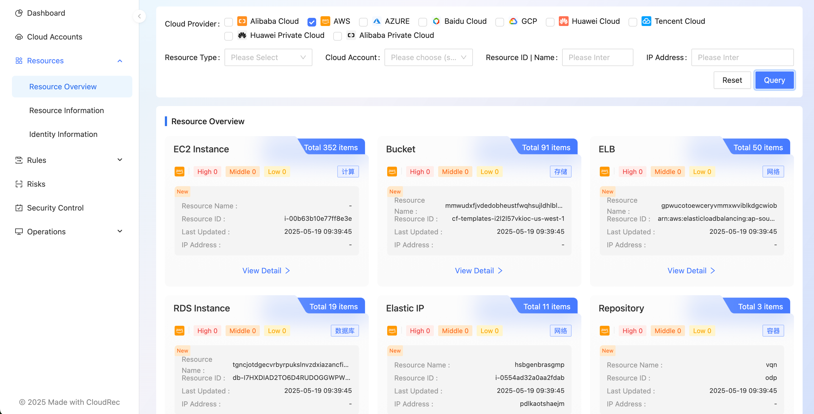

# Start CloudRec

# Add Cloud Account
First, enter the cloud account that needs to collect resources and analyze risks. 

> You need to confirm that the entered cloud account corresponds to the platform. `collector `the deployment has been successful. On the operation and maintenance center-Collector page, check whether there is a corresponding platform deployment `collector`
>

# Rsync Resources
After adding cloud account, collectors you depolyed would start to rsync resources in 5mins(default)

# Rule and RuleGroup
Run a rule or run a set of rules.

You can execute a rule manually. And all rules will be executed regularly。

Select rules you want and run them at once.

