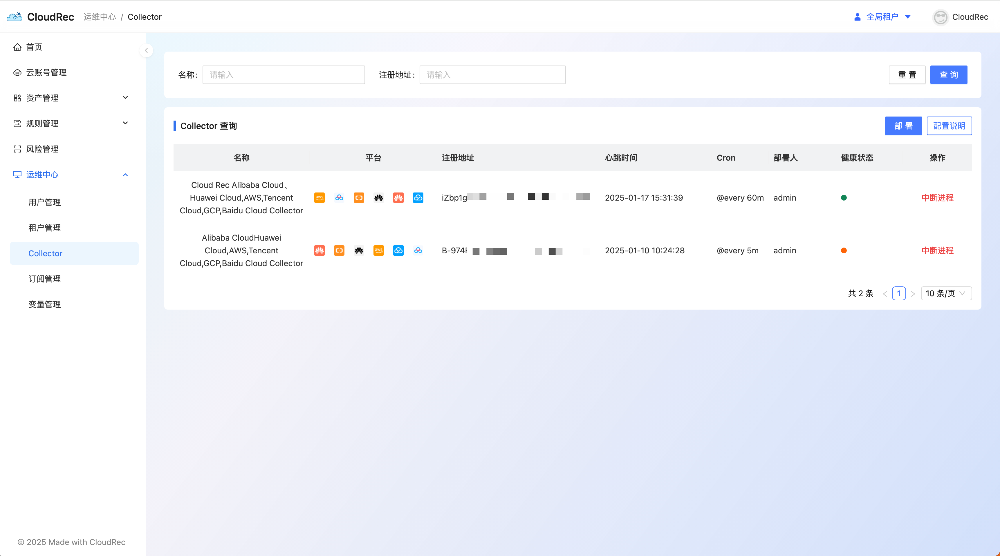

# Collector

### Deploying the CloudRec Collector 
1. click on the right **deployment **button, getting `deployment Token `with `URL of the quick deployment script `
    1. `deployment Token `: Each collector needs to use the deployment Token to authenticate with the server when deploying. The Token is invalid after use, and you need to click on the right side again to deploy it again. **Deployment **button to get a new deployment Token 
    2. `URL of the quick deployment script `: Download the quick deployment script through Alibaba Cloud OSS, which contains all the commands on which the collector is deployed at one time. 
2. More details refer [binary deployment CloudRec Collector](https://cloudrec.yuque.com/org-wiki-cloudrec-iew3sz/hocvhx/nx2syhgl3boeivqe#gY0RH)

