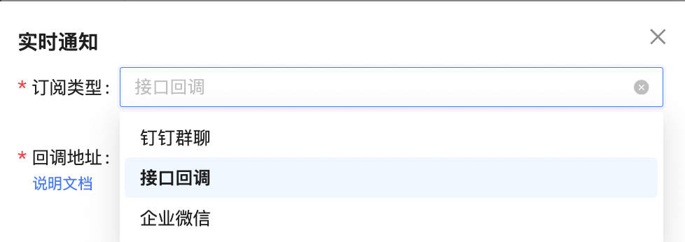
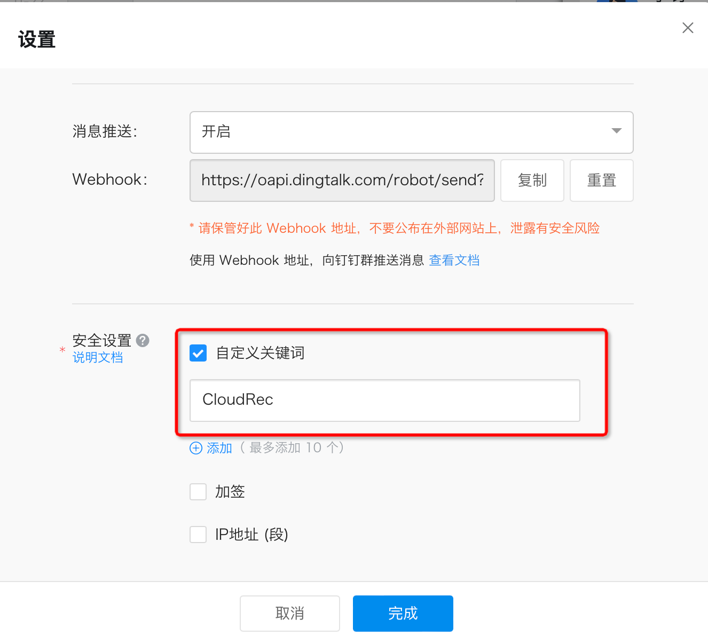

# Subscriptions

## Conditional Configuration 


if conditions 1 and 2 are met at the same time, an alarm will be triggered. 

## Action Configuration 
if the above conditions match the corresponding risk, you need to configure the alarm action again. 

Click [Add Action] to support regular notification and real-time notification 


### real-time notifications 
real-time notification, the first time the risk output alarm support three ways 




#### dingTalk group chat 


group chat name: only mark, no actual effect. 

To be notified: Webhook callback address, security settings use [automatic keyword], keyword: CloudRec 



#### interface callback 


data is sent to the callback address in a fixed format 

request Method: POST 

request parameters: 

```json
{
  "scanResult": "[{"xxx":"xxxx"}]"
}
```

deserialize a scanResult with the following structure 

`JSON.parseArray(scanResult, RuleScanResultVO.class); `

```java
public class RuleScanResultVO {

    /**
    * 风险创建时间
    */
    @JsonFormat(pattern = "yyyy-MM-dd HH:mm:ss", timezone = "GMT+8")
    private Date gmtCreate;
    /**
     * 最近一次扫描命中
     */
    @JsonFormat(pattern = "yyyy-MM-dd HH:mm:ss", timezone = "GMT+8")
    private Date gmtModified;

    /**
     * 风险id
     */
    private Long id;

    /**
     * 规则id
     */
    private Long ruleId;

    /**
     * 云账号id
     */
    private String cloudAccountId;

    /**
     * 账号别名
     */
    private String alias;

    /**
     * 资源id
     */
    private String resourceId;

    /**
     * 资源名称
     */
    private String resourceName;

    /**
     * 更新时间
     */
    private String updateTime;

    /**
     * 平台
     */
    private String platform;

    /**
     * 资产类型
     */
    private String resourceType;

    /**
     * 扫描结果的详细信息
     */
    private String result;

    /**
     * 区域信息
     */
    private String region;

    /**
     * 租户id
     */
    private Long tenantId;

    /**
     * 状态
     */
    private String status;

    /**
     * 规则快照
     */
    private String ruleSnapshoot;

    /**
     * 资产快照
     */
    private String resourceSnapshoot;

    /**
     * 最新的资产数据
     */
    private String resourceInstance;

    /**
     * 忽略的原因类型
     */
    private String ignoreReasonType;

    /**
     * 忽略的原因
     */
    private String ignoreReason;

    /**
     * 当前资源是否存在
     */
    private Boolean resourceExist;

    /**
     * 关联规则的信息
     */
    private RuleVO ruleVO;

    /**
     * 规则类型名称
     */
    private List<String> ruleTypeNameList;

    /**
     * 规则组类型名称
     */
    private String resourceGroupTypeName;

    /**
     * 规则组类型
     */
    private String resourceGroupType;

    /**
     * 规则组的图标
     */
    private String icon;
}
```

#### enterprise WeChat 
slightly 

### timed Notification 
regular notification, you can configure the alarm at a fixed time and cycle, only one more notification time setting, other settings are consistent with real-time notification.


