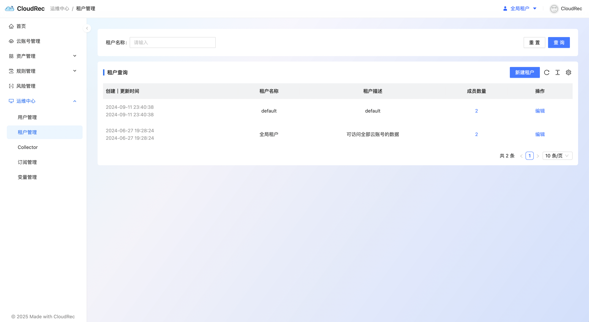

# Tenant Management

The tenant management module is used to create tenants and manage tenant members. 

There are two tenants by default: 

1. `default `all newly created users will be in the default tenant. 
2. `Global Tenant `: This is a logical tenant, and users under the global tenant can access the data of all other tenants. Cannot be used to enter a new cloud account. 

### Add users to the tenant 
click on the right side of the tenant **number of members **column, the edit tenant member page pops up from the right sidebar, Select **add Members **, enter the name of the member to be added.

