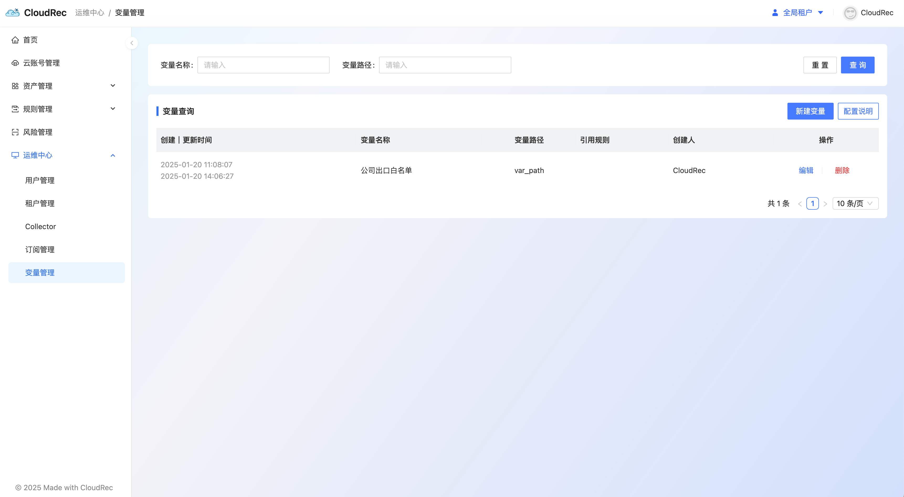
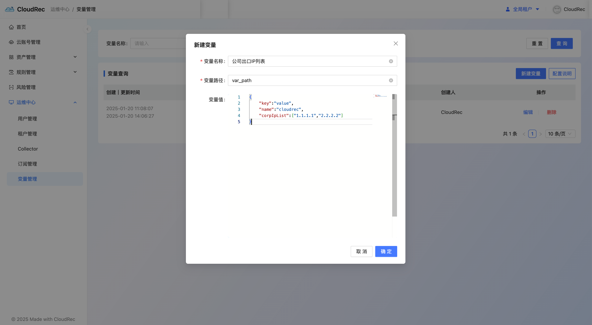
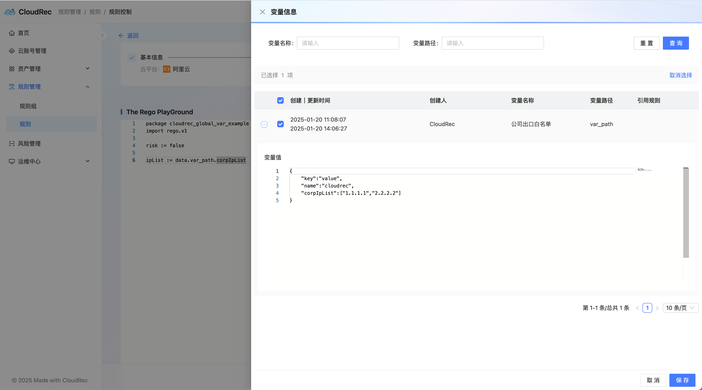

# Values

The variable management module is used to add, edit, and query global variables that can be used in Rego risk inspection rules. 

For example, using variable management, you can use the export IP list of an enterprise as a global variable in different Rego rules. 

#### Addition of variables 
1. click on the right **new Variable **button to pop up the edit box for the new variable 
2. fill in `variable name `, `variable Path `, `variable value `
    1. variable Name: The name of the variable. It is recommended that the name be readable and meaningful. 
    2. Variable path: as the unique value of the variable, to prevent conflicts. Only names supported by Rego rule are allowed. For example, Chinese is not supported. 
    3. Variable value: the actual content of the variable, in json format. 
3. Click **determine **, complete the addition of variables 

#### use of Variables 
1. when writing the Rego rule, click on the right. **Variable **label 

2. to view and select the required variables, click **save **

3. use `data.${variable path} `reference variable

