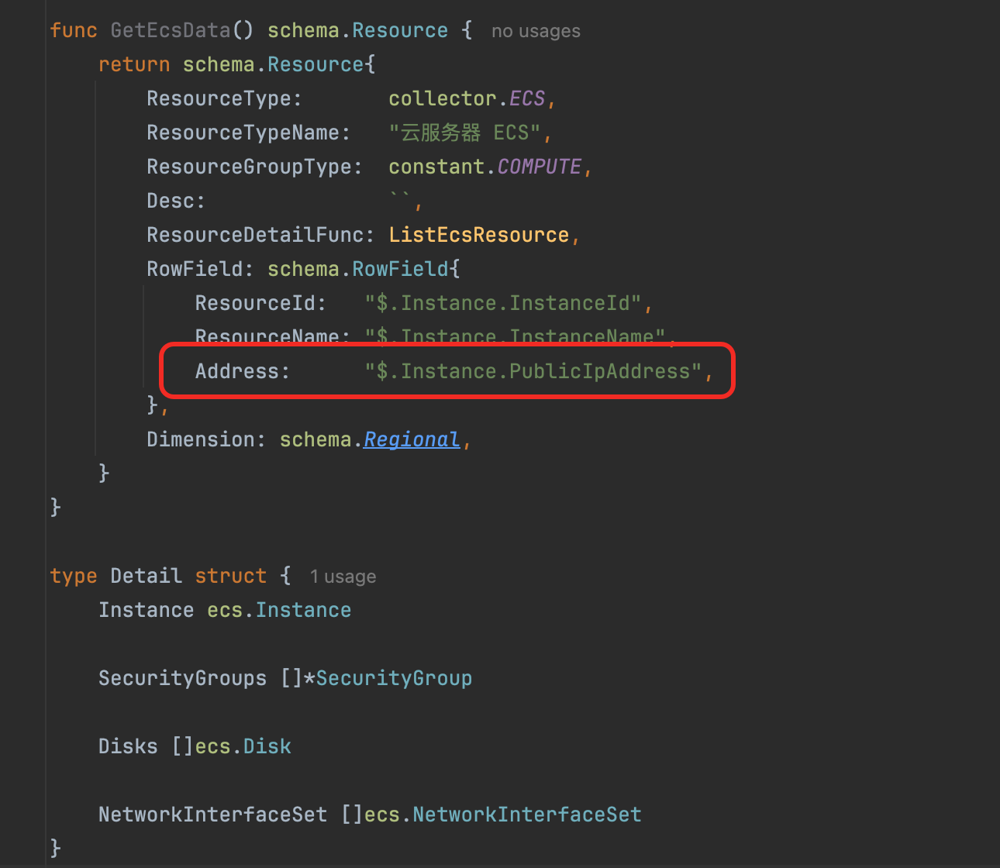
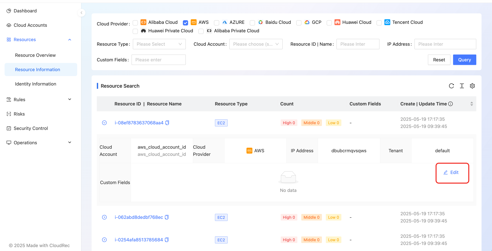
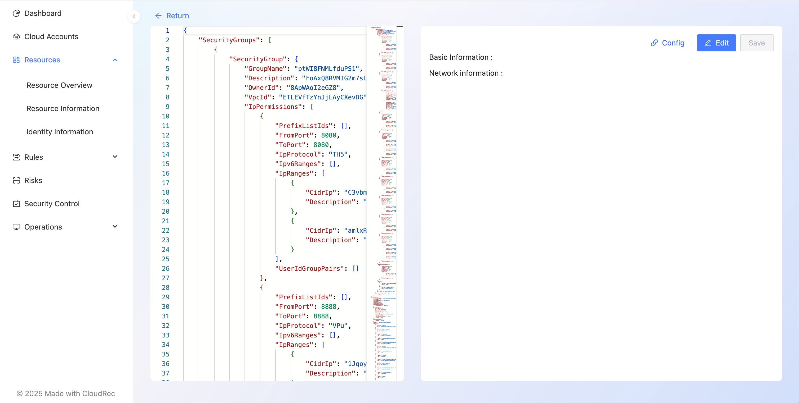

# Resource Information

Resource Information is a module for querying resource details.


Click on resource name, the metadata JSON details of the resource will pop up from the right sidebar. 


Click on the left side of the resource record **triangle symbol** button, additional fields of the resource record, such as cloud account number, cloud platform, IP address, tenant name, and custom fields, are displayed. Among them **IP address** the settings can be read [set the IP address field of the resource ](#dMo99), **custom Fields** the settings can be read [set custom fields for an resource ](#Dorhq). 


# Set the IP address field of the resource 
of resources **IP address** the value of the field comes from the core-sdk/schema/resource.go:181 in the collector. `RowField `the structure `Address `the setting of the field. Currently, only the string type is supported. 


The following figure shows how to set the Address field for an Alibaba Cloud ECS instance



# Set custom fields for an resource 
after clicking on the resource record to expand, the right **edit** button to jump to the custom field configuration page 






click on the right **edit** button to edit custom fields, click **Add field** add a custom field 


use jsonPath to get the value of the field, [jsonPath syntax description ](#yBJLR)below this section. Click the right Save button to complete the configuration 


at the top of the page, you are prompted that the save is successful and you can preview the value obtained by jsonPath. Click on the upper left corner **return** arrow returns to the resource information interface. 


You can see the custom fields configured using jsonPath in the resource details. **The configuration of the custom field takes effect for all records of the same resource type.**


### jsonPath Syntax simple description 
```json
{
    "store": {
        "book": [
            {
                "category": "reference",
                "author": "Nigel Rees",
                "title": "Sayings of the Century",
                "price": 8.95
            },
            {
                "category": "fiction",
                "author": "Evelyn Waugh",
                "title": "Sword of Honour",
                "price": 12.99
            },
            {
                "category": "fiction",
                "author": "Herman Melville",
                "title": "Moby Dick",
                "isbn": "0-553-21311-3",
                "price": 8.99
            },
            {
                "category": "fiction",
                "author": "J. R. R. Tolkien",
                "title": "The Lord of the Rings",
                "isbn": "0-395-19395-8",
                "price": 22.99
            }
        ],
        "bicycle": {
            "color": "red",
            "price": 19.95
        }
    },
    "expensive": 10
}
```
| JsonPath | Result | Value |
| --- | --- | --- |
| `$.store.bicycle.color` | The bicycle color | red |
| `$.store.book[*].author` | The authors of all books | ["Nigel Rees","Evelyn Waugh","Herman Melville","J. R. R. Tolkien"] |
| `$..author` | All authors | ["Nigel Rees","Evelyn Waugh","Herman Melville","J. R. R. Tolkien"] |
| `$.store..price` | The price of everything | [8.95,12.99,8.99,22.99,19.95] |
| `$..book.length()` | The number of books | 4 |


Reference documentation: [JsonPath GitHub](https://github.com/json-path/JsonPath)
