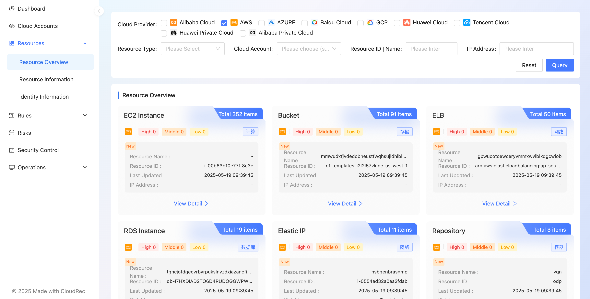

# Resource Overview

Asset aggregation is used to classify, manage and query assets collected by the platform from the perspective of cloud resources. 

Click on the card **View Details**tag, jump to the corresponding cloud resource [Resource Information ](https://cloudrec.yuque.com/org-wiki-cloudrec-iew3sz/pfamgq/va0a4s9gggpbnnmn)page.

