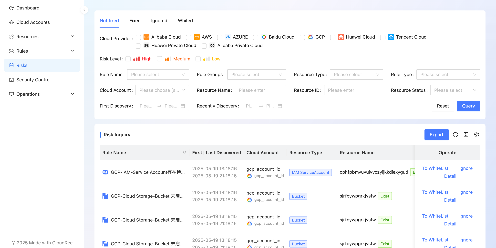

# Risks

After the rule management module uses the Rego rule to inspect the cloud resources, the resulting risks are displayed in the risk management module. 

In the risk management module, you can query the risk according to a variety of conditions, view the details, and ignore the white operation. At the same time, you can query the repaired and ignored applications.

