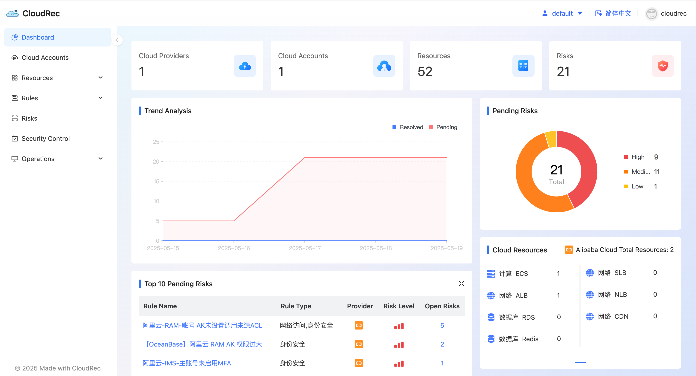
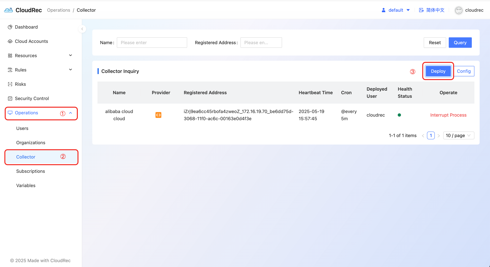

# Depoly CloudRec

### Docker & Docker Compose 
Requirements: 

+ [Install](https://docs.docker.com/engine/install/) docker engine: Version ≥ 20.10.14
+ [Install](https://github.com/docker/compose) docker-compose: Version ≥ 2.5.1
+ Machine spec：4C8G
+ Linux


1. Run the following commands

```shell
curl -L -o cloudrec-deploy.tar.gz http://cloud-rec.oss-cn-hangzhou.aliyuncs.com/cloudrec-deploy.tar.gz && tar -xzf cloudrec-deploy.tar.gz && cd cloudrec-deploy && docker-compose up -d
```

Run `docker ps` to check container startup 

```shell
cloudrec@cloudrec cloudrec-deploy % docker ps                  
CONTAINER ID   IMAGE                           COMMAND                  CREATED         STATUS         PORTS                               NAMES
b62ef8613d8e   nginx:latest                    "/docker-entrypoint.…"   8 minutes ago   Up 8 minutes   0.0.0.0:80->80/tcp                  my-nginx
c39f5ae1c031   mysql:8.0                       "docker-entrypoint.s…"   8 minutes ago   Up 8 minutes   0.0.0.0:3306->3306/tcp, 33060/tcp   cloudrec-deploy-mysql-1
0e8388b5b94c   cloudrec-deploy-cloud-rec       "sh -c 'nohup ./opa …"   21 hours ago    Up 8 minutes   0.0.0.0:8080->8080/tcp              cloudrec-deploy-cloud-rec-1
80592862d47a   cloudrec-deploy-xxl-job-admin   "sh -c 'java -jar $J…"   21 hours ago    Up 8 minutes   0.0.0.0:8090->8090/tcp              cloudrec-deploy-xxl-job-admin-1
```

View web container startup logs 

```shell
docker logs 0e8388b5b94c -f
```


2. Access **http://127.0.0.1**


3. Home page showns after logging in




### Binary deployment CloudRec Collector
1. Access the web console "Operations"-"Collector", click the "Deploy" button to obtain the collector deployment script




2. Execute script 

```shell
curl -L -o deploy_cloudrec.tar.gz http://cloud-rec.oss-cn-hangzhou.aliyuncs.com/deploy_cloudrec.tar.gz && tar -xzf deploy_cloudrec.tar.gz && cd deploy_cloudrec && nohup ./cloudrec_collector --serverUrl "http://localhost:8080" --accessToken "accessToken" > logs/task.log 2>&1 < /dev/null &
```


3. You can modify the configuration as needed in config.yaml in the decompressed file 

```yaml
# Collector name, if not configured, hostname will be used
AgentName: "CloudRec Alibaba Cloud、Huawei Cloud、AWS、Tencent Cloud Collector"

# The server URL, http://localhost:8080 is used by default, and can be adjusted according to actual conditions
ServerUrl: "http://localhost:8080"

# eg：@every 30s、@every 5m、@every 1h
# @every 5m means obtaining an account every five minutes. If the current task is finished, skip this task.
Cron: "@every 5m"

# If RunOnlyOnce is set to false, the program will be executed once immediately, but the program will not exit. It will be run regularly according to the Cron cycle.
# If RunOnlyOnce is set to true, the program will be executed once immediately and then exit.
RunOnlyOnce: false

# Access token, which is used to authenticate the request. You can get it from the server
AccessToken: "change your access token"
```

Start after modifying configuration

```shell
nohup ./cloudrec_collector --accessToken "${access token here}" > logs/task.log 2>&1 < /dev/null &
```

## Next Reading
[Start CloudRec: Add cloud account and rsync resources to do detections.](https://cloudrec.yuque.com/org-wiki-cloudrec-iew3sz/pfamgq/lampwh0q5tem03ns)

