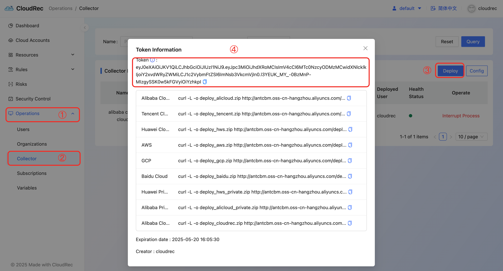

# Server && Collector

# 🛠️ Server
## Requirements
+ <font style="color:rgb(51, 51, 51);">Maven 3.8.1</font>
+ <font style="color:rgb(51, 51, 51);">Jdk17+</font>
+ <font style="color:rgb(51, 51, 51);">node </font><font style="color:#000000;">v16.20.1 +</font>

## Pre-dependency
+ Deploy OPA (open agent policy) service

```shell
curl -L -o opa https://cloud-rec.oss-cn-hangzhou.aliyuncs.com/opa_darwin_arm64_static

opa run --server --log-level debug
```

## Create the Server database
The database file for the server is located in the project Root Directory:/doc/tables.sql

## Modify the server config file
```properties
# server
spring.application.name=cloudrec
server.port=8080
server.url=http://localhost:8080
# mybatis config
mybatis.mapper-locations=classpath:/mapper/*Mapper.xml
mybatis.configuration.log-impl=org.apache.ibatis.logging.stdout.StdOutImpl
spring.datasource.url=jdbc:mysql://localhost:3306/cloudrec_db?useSSL=false&serverTimezone=Asia/Shanghai&allowPublicKeyRetrieval=true
spring.datasource.username=root
spring.datasource.driver-class-name=com.mysql.cj.jdbc.Driver
spring.datasource.password=root

opa.url=http://localhost:8181/

job.scheduler.type=local

cloudrec.rule.path=/tmp/
```

# 🛠️ Collector
## Requirements
+ Go 1.23 +

## Get AccessToken
+ follow steps below and get the accessToken



+ Configure the access token obtained to config.yaml in the root directory of the project. Start the project


## Developing
### <font style="color:rgb(71, 71, 71);">Add a new cloud platform </font>
Currently Supported Cloud Platforms 

| Alibaba Cloud  |
| --- |
| AWS  |
| HUAWEI CLOUD  |
| Tencent Cloud  |
| Baidu Cloud |
| GCP  |


If you want to add a new cloud platform, please communicate in advance.

### Add a new cloud service for data collection 
please refer to the cloud services corresponding to the currently supported cloud platforms: [list of currently supported asset collections ](https://cloudrec.yuque.com/org-wiki-cloudrec-iew3sz/pfamgq/wx0er2045iwivp03)

or view it under/collector/constant.go on the tail cloud platform, for example: `tail alicloud/collector/constant.go`

### Create a package with a cloud service name 
if the cloud product already exists and only associates more related data, omit this step.

### Defining a Resource 
1. Manage the ResourceType of the cloud service in constant.go, and ensure that the ResourceType does not contain Chinese characters and spaces. Once the ResourceType is created, it can only be deleted from the server database. 
2. Use the json path to obtain a value from the detail. Only ResourceId is required.

```go
func GetResource() schema.Resource {
	return schema.Resource{
		ResourceType:       provider.EC2,
		ResourceTypeName:   "EC2",
		ResourceGroupType:  constant.COMPUTE,
		Desc:               `https://next.api.aliyun.com/api/Ecs/2014-05-26/DescribeSecurityGroupAttribute?RegionId=cn-hangzhou`,
        
		ResourceDetailFunc: GetSecurityGroupDetail,

        // ResourceId is required
		RowField: schema.RowField{
			ResourceId:   "$.Instance.InstanceId",
			ResourceName: "$.Instance.InstanceName",
		},

		Dimension: schema.Regional,
	}
}
```


### Create a Detail structure 
Detail can be considered as an instance of a cloud product. Manage your asset json in Detail.

```go

type Detail struct {
    Instance types.Instance

    // Others
    // ... 
}
```


### Create a client of the corresponding cloud product 
if the cloud product already exists and only associates more related data, omit this step. 

You need to initialize the corresponding client in `collector/services.go` and use `switch case`to select, for example:

```go

type Services struct {
	CloudAccountId  string
	Config          *openapi.Config
	ECS             *ecs.Client
	VPC             *vpc.Client
    // ... other client
}

func (s *Services) InitServices(param schema.CloudAccountParam) (err error) {
	s.CloudAccountId = param.CloudAccountId
	s.Config = openapiConfig(param.Region, param.AK, param.SK)

	switch param.ResourceType {

	case ECS, SecurityGroup:
		s.ECS, err = ecs.NewClientWithAccessKey(param.Region, param.AK, param.SK)
		if err != nil {
			log.GetWLogger().Error(fmt.Sprintf("failed to initialize ECS client in region:%s, err:%s", param.Region, err.Error()))
		}
	case VPC:
		s.VPC, err = vpc.NewClientWithAccessKey(param.Region, param.AK, param.SK)
    }
    // ... other client

	return nil
}
```

###  Create a callback function for ResourceDetailFunc 
you can implement the ResourceDetailFunc callback function, use the cloud product client you just created, obtain the instance data, store the instance data in the Detail structure created in the 2.3, and finally submit the data to the res pipeline in the loop (don't wait until the loop is over before submitting it in a unified way). Since the cloud platform api limits the number of rows per request, you need to page through the information of the cloud product.

```go

func DescribeInstance(ctx context.Context, service schema.ServiceInterface, res chan<- any) (err error) {
    client := service.(*provider.Services).EC2

    input := &ec2.DescribeInstancesInput{
        NextToken: nil,
    }
    output, err := client.DescribeInstances(ctx, input)
    if err != nil {
        return err
    }
    instances := output.Reservations[0].Instances
    for output.NextToken != nil {
        input = &ec2.DescribeInstancesInput{
            NextToken: output.NextToken,
        }
        output, err = client.DescribeInstances(ctx, input)
        instances = append(instances, output.Reservations[0].Instances...)
    }

    for _, instance := range instances {
        res <- DescribeInstanceOutput{
            Instance: instance,
        }
    }

    return nil
}
```


If cloud products are divided into regions, you do not need to traverse regions, and the platform will use _**schema.Platform**_the global DefaultRegions defined in is used as the default region to be traversed. If you are sure that your cloud products only exist in certain regions, you can define _**specify schema.Resource to avoid invalid requests.**_, if the cloud product does not need to traverse the region, it only needs _**Dimension**_change to Global. For example:

```go
func GetWAFResource() schema.Resource {
	return schema.Resource{
		ResourceType:       collector.WAF,
		ResourceTypeName:   collector.WAF,
		ResourceGroupType:  constant.SECURITY,
		Desc:               `https://api.aliyun.com/api/waf-openapi/2021-10-01/DescribeInstance?sdkStyle=old&tab=DOC&params={%22RegionId%22:%22cn-hangzhou%22}`,
		ResourceDetailFunc: GetInstanceDetail,
		RowField: schema.RowField{
			ResourceId: "$.Instance.InstanceId",
		},
		Dimension: schema.Global,
		Regions:   []string{"cn-hangzhou", "ap-southeast-1"},
	}
}

```


### Call GetResource() 
finally call the one you just created. _**schema.Resource**_

```go
func GetPlatformConfig() *schema.Platform {
	alicloudRegions := []string{
		"cn-beijing", "cn-beijing-finance-1", "cn-chengdu", "cn-guangzhou", "cn-hangzhou", "cn-heyuan", "cn-hongkong", "cn-huhehaote", "cn-qingdao", "cn-shanghai", "cn-shanghai-finance-1", "cn-shenzhen", "cn-shenzhen-finance-1", "cn-wulanchabu", "cn-zhangjiakou", "ap-northeast-1", "ap-south-1", "ap-southeast-2", "ap-southeast-3", "ap-southeast-5", "eu-central-1", "eu-west-1", "me-east-1", "us-east-1", "us-west-1"}

	return schema.GetInstance(schema.PlatformConfig{
		Name: string(constant.AlibabaCloud),
		Resources: []schema.Resource{
			cloudfw.GetCloudFWResource(),
            // ... other resource
		},

		Service:        &collector.Services{},
		DefaultRegions: alicloudRegions,
	})
}
```

## Complete example
```go
package cloudfw

import (
	"github.com/core-sdk/constant"
	"github.com/core-sdk/log"
	"github.com/core-sdk/schema"
	"context"
	"github.com/cloudrec/alicloud/collector"
	cloudfw20171207 "github.com/alibabacloud-go/cloudfw-20171207/v5/client"
	"github.com/alibabacloud-go/tea/tea"
	"strconv"
	"time"
)

func GetCloudFWResource() schema.Resource {
	return schema.Resource{
		ResourceType:                 collector.Cloudfw,
		ResourceTypeName:             collector.Cloudfw,
		ResourceGroupType:            constant.NET,
		Desc:                         `https://api.aliyun.com/api/Cloudfw/2017-12-07/DescribeAssetList?tab=DEBUG&params={%22CurrentPage%22:%221%22,%22PageSize%22:%22100%22}`,
		ResourceDetailFuncWithCancel: GetInstanceDetail,
		Dimension:                    schema.Global,
	}
}

func GetInstanceDetail(ctx context.Context, cancel context.CancelFunc, service schema.ServiceInterface, res chan<- any) error {

	cli := service.(*collector.Services).Cloudfw
	direction := []string{"in", "out"}
	for _, d := range direction {
		page := 1
		size := 50
		count := 0
		for {
			select {
			case <-ctx.Done():
				log.GetWLogger().Error("time out !!! please check your code")
				return nil
			default:
				req := &cloudfw20171207.DescribeControlPolicyRequest{}
				req.CurrentPage = tea.String(strconv.Itoa(page))
				req.PageSize = tea.String(strconv.Itoa(size))
				req.Direction = tea.String(d)
				resp, err := cli.DescribeControlPolicyWithOptions(req, collector.RuntimeObject)
				if err != nil {
					cancel()
					return err
				}

				bd := resp.Body
				count += len(bd.Policys)
				req.PageSize = tea.String(strconv.Itoa(size))
				for i := 0; i < len(bd.Policys); i++ {
					res <- Detail{
						Policy: bd.Policys[i],
					}
				}
				if bd.TotalCount != nil && strconv.Itoa(count) >= *bd.TotalCount {
					cancel()
					return nil
				}
				page += 1
				req.CurrentPage = tea.String(strconv.Itoa(page))
				time.Sleep(1 * time.Second)
			}
		}
	}

	return nil
}

type Detail struct {
	Policy *cloudfw20171207.DescribeControlPolicyResponseBodyPolicys
}

```

## Precautions 
1. the loop exit condition is wrong, and the request cannot exit all the time (please make sure that the code on the commit can exit, otherwise the request will be blocked) [How to Test ](https://cloudrec.yuque.com/org-wiki-cloudrec-iew3sz/pfamgq/pacts039n3e5iqba)
2. cloud product configurations that do not distinguish between regions _**Dimension**_for Regional 
3. cloud products only exist in some regions, but regions are not specified in the Resource definition 
4. other non-standard code

# ❓QA
## How to Start Only Collector of Alibaba Cloud Platform 
just enter the alicloud directory, and the other steps are the same as the process 1.1 above.


