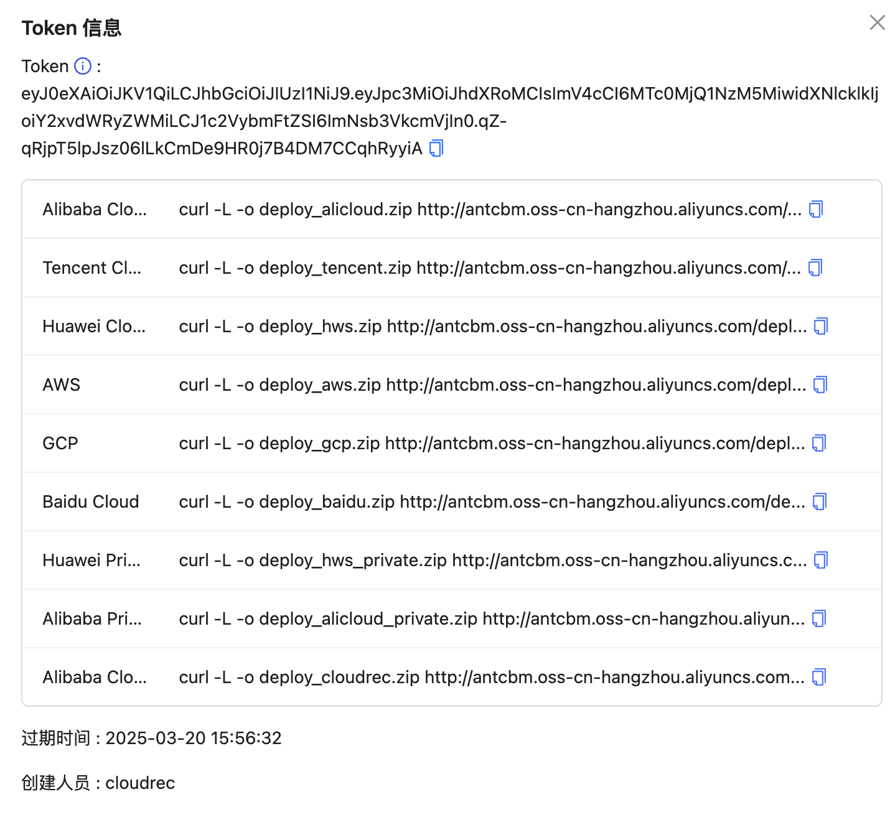

# Source code deployment

# Requirements

1. prepare a Linux CentOS server with a configuration of not less than 2c4g and install Java17

```json
apt install openjdk-17-jre-headless 
```

> or manual installation
>

```shell
wget https://download.java.net/java/GA/jdk17.0.2/dfd4a8d0985749f896bed50d7138ee7f/8/GPL/openjdk-17.0.2_linux-x64_bin.tar.gz

tar -xvf openjdk-17.0.2_linux-x64_bin.tar.gz

sudo mv jdk-17.0.2 /usr/local/

echo 'export PATH=$PATH:/usr/local/jdk-17.0.2/bin' >> ~/.bashrc

source ~/.bashrc
```

2. OPA service
   deployment ( [https://www.openpolicyagent.org/docs/latest/#running-opa ](https://www.openpolicyagent.org/docs/latest/#running-opa)) (
   It is recommended to deploy opa and server together)

```shell
curl -L -o opa http://cloud-rec.oss-cn-hangzhou.aliyuncs.com/opa_linux_amd64_static
```

3. start opa

```shell
chomd +x opa
nohup ./opa run --server --log-level error > opa.log 2>&1 &
```

4. create an RDS,oceanbase or mysql, keep the link address, user name, password and other link information, and
   configure the rds and server under a VPC.

> At the same time, rds needs to remove the ONLY_FULL_GROUP_BY value in SQL _mode in the parameter settings (a restart
> is required to take effect)
>


+ enable external network access for rds, and execute init.sql,the sql file location: `/doc/db/table.sql`

# ⚙️ Installation Deployment

1. Generate jar file

+ clone repository

```shell
git clone https://github.com/antgroup/CloudRec.git
```

+ package

```shell
cd CloudRec && mvn package
```

+ Upload file

```shell
scp app/bootstrap/target/cloudrec.jar <your_user>@<your_ip>:/home/cloudrec
```

2. Create a name in the same directory as the jar file: <font style="color:#080808;background-color:#ffffff;">
   cloudrec-prod.properties configuration files, modify the configuration as needed, mainly with black and underlined
   parts, such as automatic initialization rules. For details, see Step 3 [Import Rules]] </font>

```json
# server
spring.application.name=cloudrec
server.port=8080
server.url=http: //localhost:8080

# mybatis config
mybatis.mapper-locations=classpath:/mapper/*Mapper.xml
mybatis.configuration.log-impl=org.apache.ibatis.logging.stdout.StdOutImpl
spring.datasource.url=jdbc: mysql: //localhost:3306/cloudrec_db?useSSL=false&serverTimezone=Asia/Shanghai&allowPublicKeyRetrieval=true
spring.datasource.username=username
spring.datasource.password=password


opa.url=http://localhost:8181/

collector.bucket.url=http: //cloud-rec.oss-cn-hangzhou.aliyuncs.com

job.scheduler.type=local

# Change to the directory where the jar file resides
# If configured, the system rules are automatically initialized
cloudrec.rule.path=
```

3. executes the startup command: loads both the default configuration and the specified file

```shell
nohup java -jar cloudrec.jar --spring.config.additional-location=file:./cloudrec-prod.properties > ./cloudrec.log 2>&1 &
```

# ️ Import Rules

1. obtain the compressed package of rules from oss

```shell
curl -L -o rules.tar.gz https://cloud-rec.oss-cn-hangzhou.aliyuncs.com/rules.tar.gz
```

decompress: `tar -xzf rules.tar.gz `

2. decompress the rules and put them on the server. Modify <font style="color:#080808;background-color:#ffffff;">in the
   cloudrec-prod.properties file, set cloudrec.rule.path to the path name of the rule package. (Do not include rules. If
   the path after decompressing rules is/home/admin/cloudrec, set it to/home/admin/cloudrec/instead
   of/home/admin/cloudrec/rules.) </font>

+ <font style="color:#080808;background-color:#ffffff;">restart service </font>

```shell
nohup java -jar cloudrec.jar --spring.config.additional-location=file:./cloudrec-prod.properties > ./cloudrec.log 2>&1 &
```

# Deployment collection end

1. access the 8080 port of the server after startup


2. the default account cloudrec password cloudrec, after logging in, click the operation and maintenance
   center-Collector =&gt; click [deploy]]



3. select to copy the lowest installation command and execute it on the server side.
4. Refresh the page after execution, which means that the collection side is deployed successfully.


